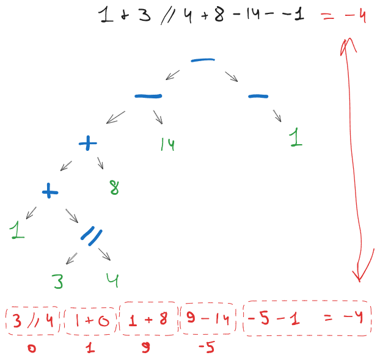
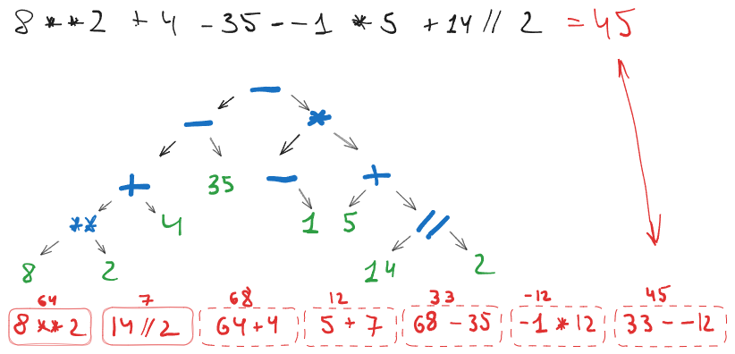

# Разбор AST дерева выражения

Фрагмент таблицы приоритетов для операторов, похожих на математические:

Выполняется слева направо(при оператарах равных для групп приоритетов), снизу вверх по дереву AST.

 • Группа 1, выполняются первыми

- `**` возведение в степень.

 • Группа 2

- `+` признак положительного числа для одного аргумента, например `+1`
- `-` признак отрицательного числа для одного аргумента, например `-2`

 • Группа 3

- `*` умножение
- `/` деление
- `//` целочисленное деление (не путать с комментарием в C++ и Java)
- `%` остаток от деления (потом расскажу, что это такое)

 • Группа 4, выполняются последними

- `+` сложение двух аргументов
- `-` вычитание двух аргументов

## 1 + 3 // 4 + 8 - 14 - -1

## 8**2 + 4 - 35 - -1 * 5 + 14 // 2

